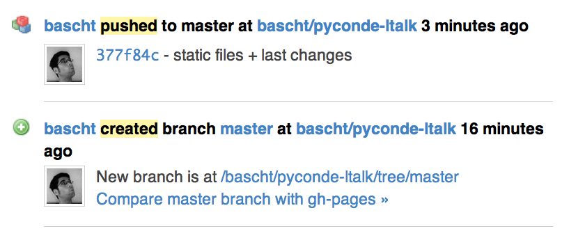
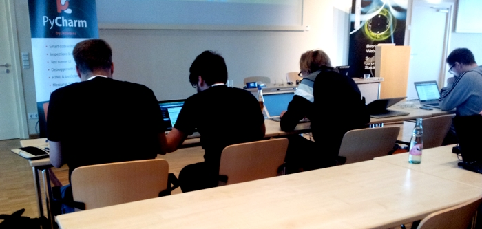

!SLIDE 
# Zu Gast in der Python Community

!SLIDE center transition=scrollLeft

!SLIDE commandline center incremental transition=scrollLeft

# First things first

    $ Dankeschön.

!SLIDE commandline center incremental transition=scrollLeft
# whoami

    $ id
    uid=502(bascht) gid=20(leipzig) 
    groups=21(ruby),22(php),403(pyug)

!SLIDE bullets incremental transition=scrollLeft
# Beobachtungen

* Linux!
* Windows!
* Bitbucket!
* Wissenschaftler!
* Praxis!!
* "gehobener" Altersdurchschnitt

!SLIDE center transition=scrollLeft
# Nerds!

!SLIDE transition=scrollLeft
# Gut organisierte Nerds.

<!SLIDE center transition=fade>
<video src="/image/one/stairs.m4v" type="video/mp4" autoplay="true" preload="auto" controls="controls"></video>

!SLIDE incremental transition=scrollLeft
# Parallelen
* Die CMS Seuche
* Der Packagemanager-War
* WSGI + Rack

!SLIDE incremental transition=scrollLeft
# Call for Speakers

* Speaker sind Menschen
* **Macht** es einfach
* Gründet Usergroups
* Geht zu »den Anderen«

!SLIDE incremental center transition=scrollLeft
# Fragen?

**@bascht**

github.com/bascht

