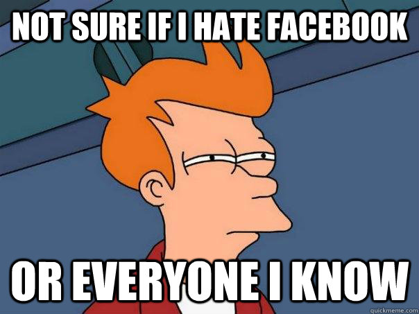
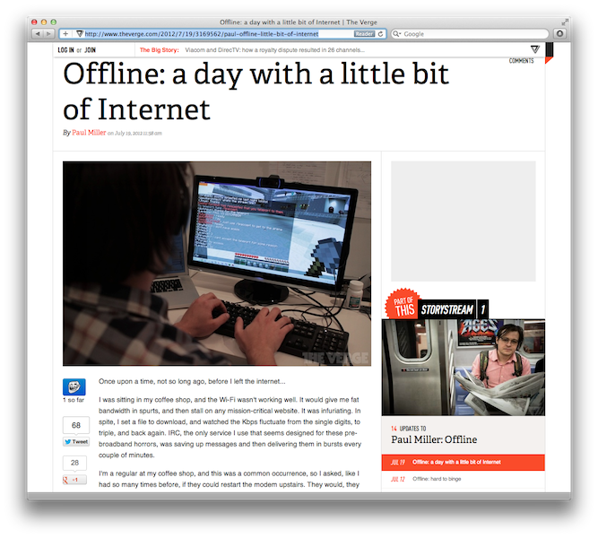
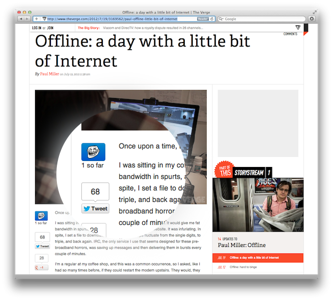
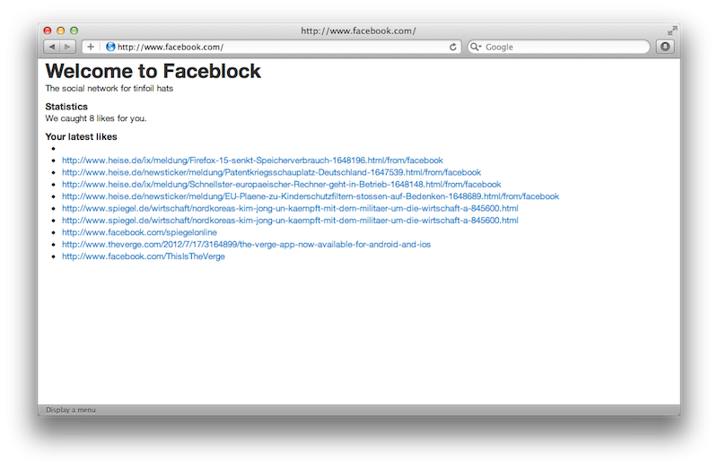
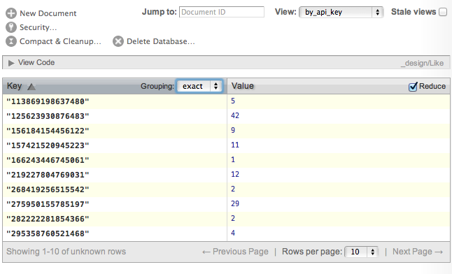
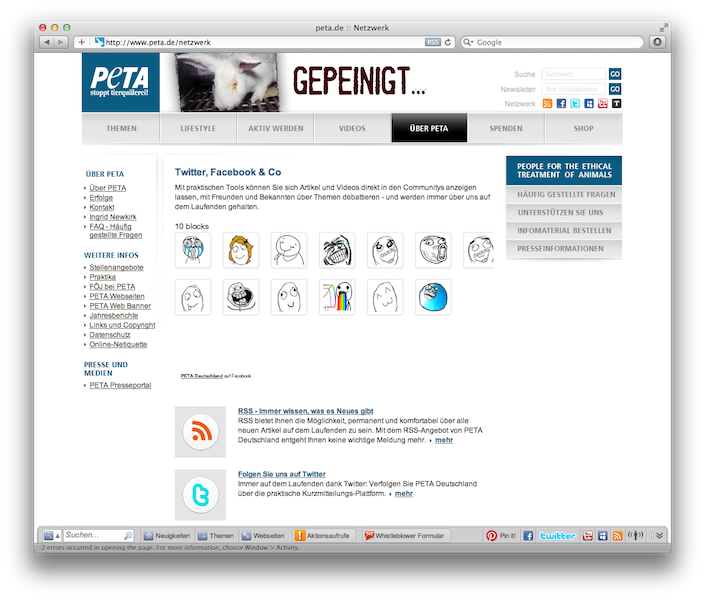

!SLIDE bullets incremental huge transition=scrollLeft
# @bascht #
* Freelance DevOp
* First Meme Officer
* SEO Expert 
    
*	*(Search Google for "bascht"!)*

!SLIDE smaller transition=blindY
# I deleted my Bookface account. #

!SLIDE smaller
# I deleted my Bookface account. #
# Twice. #

!SLIDE smaller image center transition=fade

!SLIDE code small transition=blindY
# /etc/hosts #
127.0.0.1 www.facebook.com facebook.com
127.0.0.1 static.ak.fbcdn.net www.static.ak.fbcdn.net
127.0.0.1 login.facebook.com www.login.facebook.com
127.0.0.1 fbcdn.net www.fbcdn.net
127.0.0.1 fbcdn.com www.fbcdn.com
127.0.0.1 static.ak.connect.facebook.com
127.0.0.1 www.static.ak.connect.facebook.com

!SLIDE incremental bullets small transition=blindY
# Facebook is here to stay. #
* Deal with it.

!SLIDE incremental bullets  transition=blindY
# Where I may roam &hellip; #
* Like buttons
* Like boxes
* Facebook connect
* Facebook apps

!SLIDE  transition=blindY
# So, lets harvest it. #

!SLIDE huge
# Facebook. #
!SLIDE huge co
# Faceblock. #

!SLIDE huge code transition=blindY
# Faceblock. #

    @@@ruby
    get :like, :map => "/plugins/like.php" do
      track_this_shit
    end

!SLIDE smaller transition=blindY
# http://github.com/bascht/faceblock #

!SLIDE center transition=blindY

!SLIDE center

!SLIDE center
# Stats #

!SLIDE center
# Analyze! #

!SLIDE huge  transition=blindY
# Bonus #

!SLIDE center

!SLIDE  center

[photo.php](http://www.facebook.com/photo.php?fbid=197661820345466&set=o.180973711913290&type=3&theater)

!SLIDE smaller
# http://github.com/bascht/faceblock #